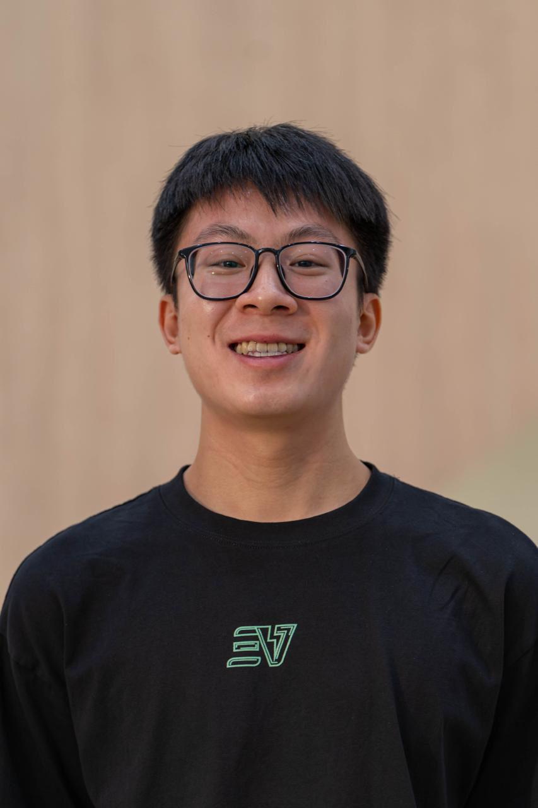
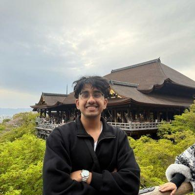
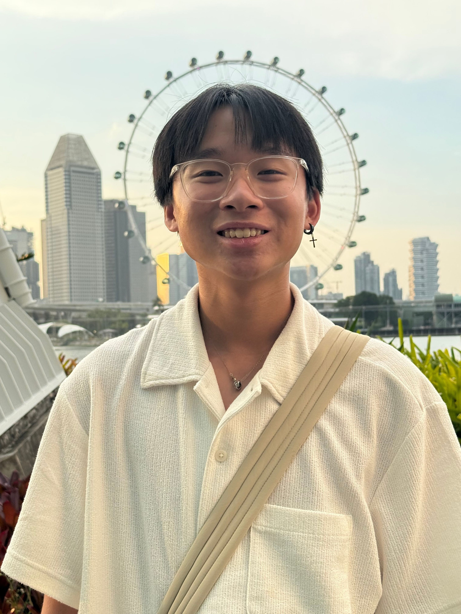
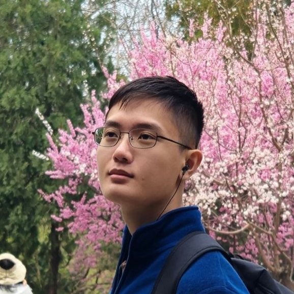
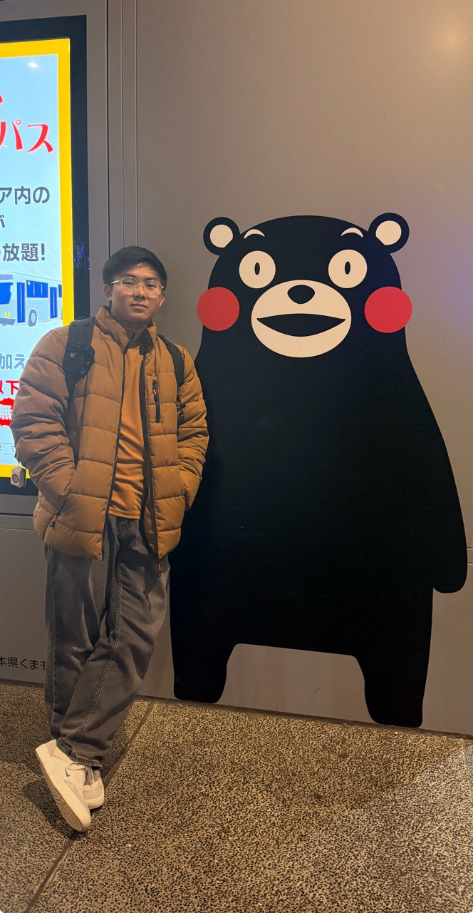

We are a team based in the [School of Computing, National University of Singapore](https://www.comp.nus.edu.sg).

## Project team

### Min Wenn

[[homepage](https://ay2627s1-cs2103t-f13-4.github.io/tp/)]
[[github](https://github.com/minweed)]

- Role: Developer
- Responsibilities: UI mockup

### Pranav Pappu

[[github](https://github.com/pranavp311)]

- Role: Developer
- Responsibilities: README documentation

### Dylan Sim

[[github](https://github.com/dygrik)]

- Role: Developer
- Responsibilities: Developer Guide

### Lee Jian Yi

[[github](https://github.com/savemywifi)]

- Role: Developer
- Responsibilities: Website navigation and settings

### Mervin Ang

[[github](https://github.com/nivremi)]

- Role: Developer
- Responsibilities: Use cases, non-functional requirements and glossary
