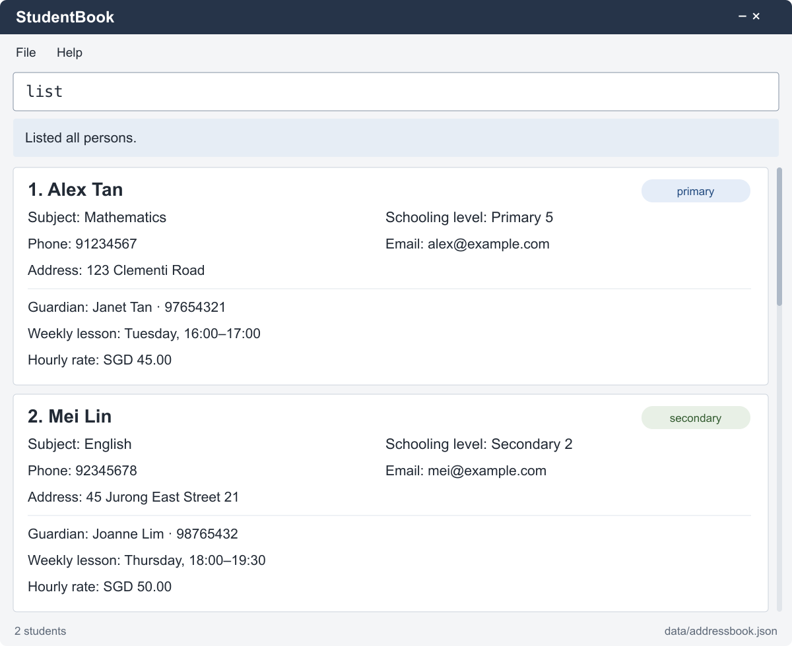

**StudentBook is a desktop application being developed for independent private tutors.** While it has a GUI, most of the user interactions happen using a CLI (Command Line Interface).

* If you are interested in using StudentBook, head over to the [_Quick Start_ section of the **User Guide**](UserGuide.html#quick-start).
* If you are interested in developing StudentBook, the [**Developer Guide**](DeveloperGuide.html) is a good place to start.

The planned core MVP retains AB3 name, phone, email, address and tags, and adds optional subject, schooling level and guardian details. The current application still provides inherited AB3 functionality. See [Student model and scope](StudentModel.md) for the planned design.

**Acknowledgements**

* Libraries used: [JavaFX](https://openjfx.io/), [Jackson](https://github.com/FasterXML/jackson), [JUnit5](https://github.com/junit-team/junit5)
